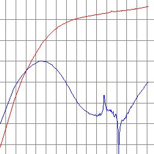
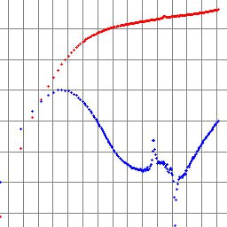
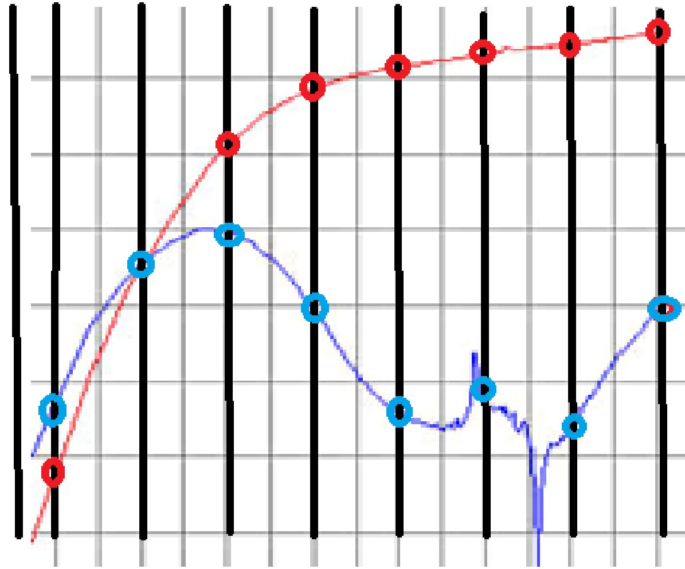

# PressureAI

Решение команды **AI Integration** для многозадачного анализа изображений временных рядов с использованием искусственного интеллекта. Модель выполняет бинарную классификацию наличия явлений и регрессию для оценки их численных параметров на основе изображений графиков давления и производных от давления.

Этот репозиторий содержит все файлы, необходимые для воспроизведения экспериментов и запуска готового решения. Если вы хотите повторить обучение модели, перейдите в папку **train** и следуйте инструкции. Для запуска модели на новых данных перейдите в папку **inference** и следуйте инструкции.


---

## Описание решения

Мы используем нейросеть, основанную на архитектуре **ResNet101**, модифицированную для решения двух задач одновременно:
- **Бинарная классификация** (8 меток)
- **Регрессия** (7 числовых признаков)

Входными данными являются изображения, полученные из временных рядов данных о давлении и производных.

## Предобработка данных

<div style="display: flex; justify-content: center;">
  &nbsp; &nbsp;
  &nbsp; &nbsp;
  
</div>

## Используемая архитектура

- **MultiTaskResNet** на основе ResNet101
- Первый слой адаптирован под 6 каналов входного изображения (два изображения, каждое с 3 RGB-каналами)
- Две выходные головы: для классификации и регрессии


---

## Метрики оценки

При оценке модели использовались:
- **Accuracy** и **Macro-F1** для бинарной классификации.
- **MSE и MAE** для регрессии.
- **Комбинированная метрика**, учитывающая качество классификации и регрессии (70% - классификация, 30% - регрессия).

---

## Зависимости

- Python 3.x
- PyTorch
- torchvision
- accelerate
- numpy, pandas, matplotlib, scikit-learn
- Streamlit

---

## Установка зависимостей

```bash
pip install torch torchvision accelerate pandas numpy matplotlib scikit-learn streamlit
```

---

## Контакты

Для вопросов и предложений открывайте issue в репозитории или обращайтесь к @gsvasiliy.


